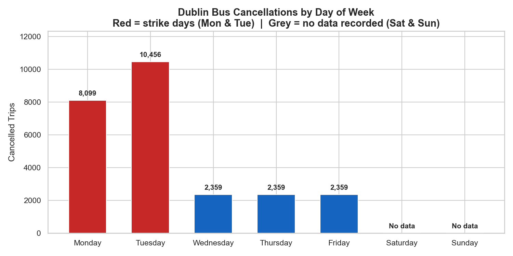
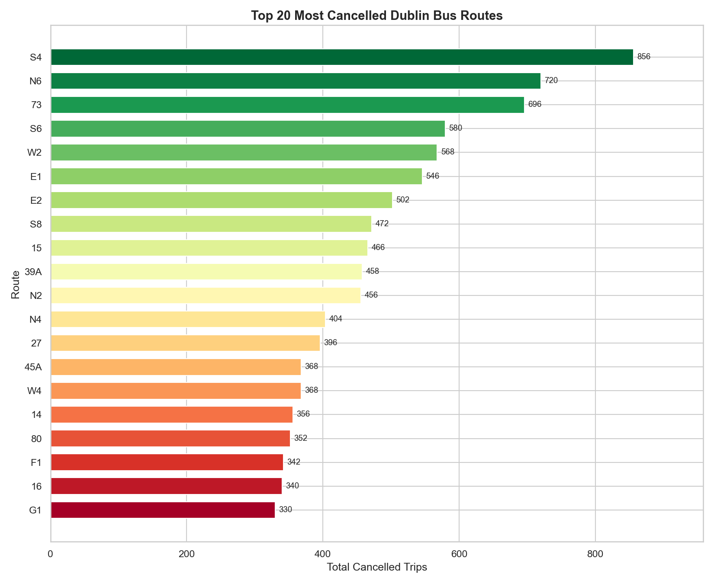
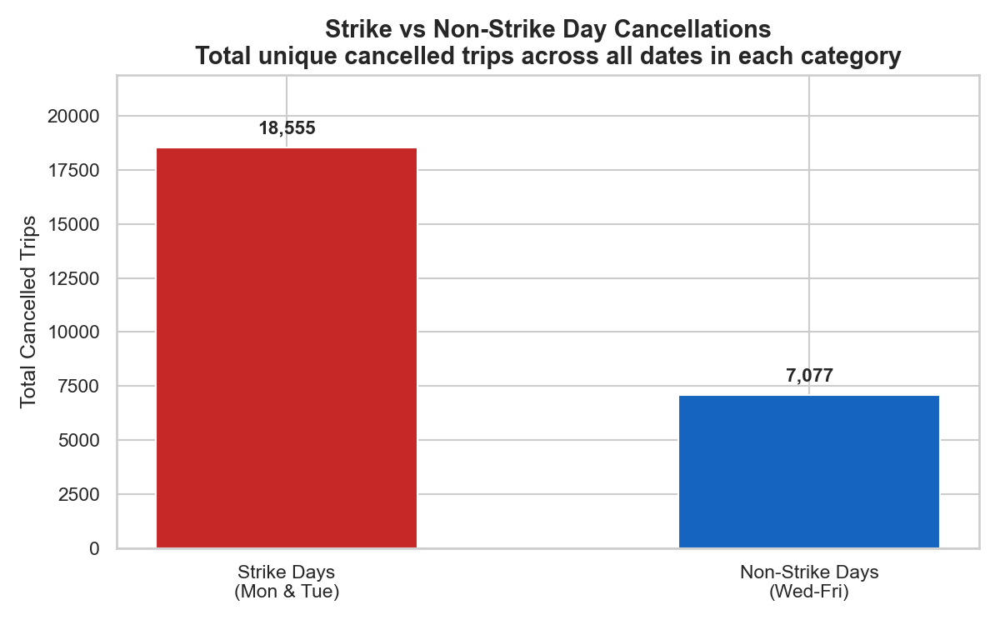
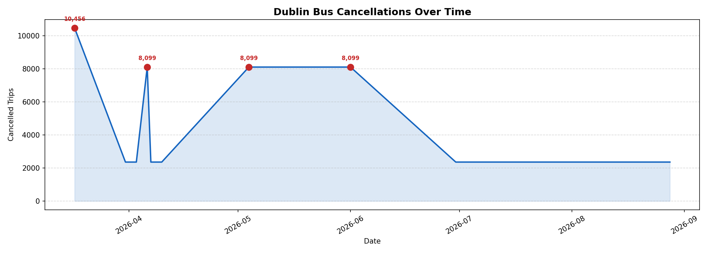
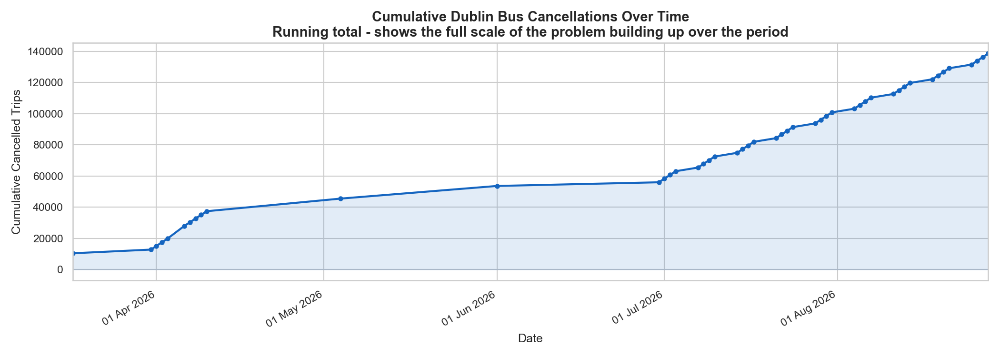
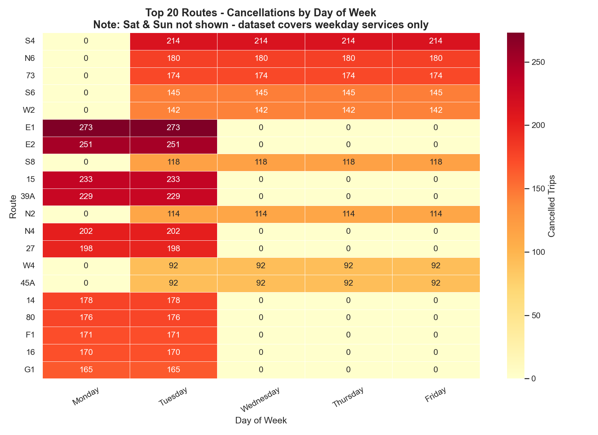

# Dublin Bus Cancellation Analysis — Report

**Module:** DATA 2005 Data Centric Programming  
**Team:** Cillian Chatham, Tyler Brady, Ilya Mikava, Ivan Kubskyi  
**Report author:** Ivan Kubskyi (Reporting)  
**Generated:** 27 April 2026  
**Data coverage:** 17 March 2026 – 28 August 2026

---

## 1. Introduction

Dublin Bus is the main public transport operator in the Greater Dublin Area, running hundreds of routes across the city and suburbs. This report summarises the findings of a data engineering and analysis pipeline applied to GTFS (General Transit Feed Specification) static data published by Ireland's National Transport Authority (NTA).

The central question this project investigates is: **which routes, days, and time periods are most affected by service cancellations** — or "ghost buses" — trips that are scheduled but never actually run.

The pipeline was built in Python and covers data loading, cleaning, validation, cancellation analysis, web scraping, and export. This report draws on the processed output files to present the findings clearly.

---

## 2. Dataset Overview

The analysis uses seven GTFS files from Transport for Ireland covering Dublin Bus, Nitelink, and Go-Ahead Ireland services.

| File | Records | Description |
|------|---------|-------------|
| stop_times_dublin_bus.txt | 4,349,048 | Scheduled arrival/departure times at every stop |
| trips.txt | 249,682 | Individual bus journeys |
| routes.txt | 805 (172 Dublin Bus) | Route definitions |
| calendar.txt | 314 | Weekly service schedules |
| calendar_dates.txt | 2,444 | Service exceptions — cancellations (type 2) and additions (type 1) |
| stops.txt | 14,024 | Stop names and GPS coordinates |
| agency.txt | 101 | Transit operators |

**Data period covered:** 17 March 2026 – 28 August 2026

---

## 3. High-Level Summary

| Metric | Value |
|--------|-------|
| Total unique cancelled trips | 25,632 |
| Dublin Bus routes affected | 160 |
| Unique dates with cancellations | 48 |
| Average cancellations per affected date | 534.0 |
| Most cancelled route | S4 — Liffey Valley - UCD (856 trips) |
| Day with most cancellations | Tuesday (10,456 trips) |
| Weekend cancellations | 0 |
| Weekday cancellations | 25,632 |

The most striking finding is that **all cancellations fall on weekdays** — zero cancellations were recorded on Saturdays or Sundays. This strongly suggests the disruption is tied to weekday operational pressures, not random or weather-related factors.

---

## 4. Cancellations by Day of Week

| Day | Cancelled Trips | % of Total |
|-----|----------------|------------|
| Monday *(strike days)* | 8,099 | 31.6% |
| Tuesday *(strike days)* | 10,456 | 40.8% |
| Wednesday | 2,359 | 9.2% |
| Thursday | 2,359 | 9.2% |
| Friday | 2,359 | 9.2% |
| Saturday | 0 | 0.0% |
| Sunday | 0 | 0.0% |

Monday and Tuesday account for the largest share of cancellations, which the visualisation team identified as corresponding to **strike days**. Wednesday through Friday show a consistent lower level, and weekends are completely unaffected.

---

## 5. Most Cancelled Routes

The table below shows the ten routes with the highest number of cancelled trips across the analysis period.

| Rank | Route | Description | Cancelled Trips | Affected Dates |
|------|-------|-------------|----------------|----------------|
| 1 | **S4** | Liffey Valley - UCD | 856 | 45 |
| 2 | **N6** | Finglas Village - Naomh Barróg GAA | 720 | 45 |
| 3 | **73** | Kilnamanagh Road - Griffith Avenue East | 696 | 45 |
| 4 | **S6** | The Square - Blackrock Station | 580 | 45 |
| 5 | **W2** | The Square - Liffey Valley SC | 568 | 45 |
| 6 | **E1** | Ballywaltrim - Northwood | 546 | 4 |
| 7 | **E2** | Dun Laoghaire - Harristown | 502 | 4 |
| 8 | **S8** | Kingswood Avenue - Dun Laoghaire Stn | 472 | 45 |
| 9 | **15** | Ballycullen Road - Clongriffin | 466 | 4 |
| 10 | **39A** | Ongar - UCD Belfield | 458 | 4 |

Route **S4** (Liffey Valley – UCD) is the worst affected with 856 cancelled trips. This route serves a high-demand corridor connecting a major shopping and employment hub to University College Dublin, so repeated cancellations will have a significant impact on both students and commuters.

Routes in the **N** series (night services), **S** series (orbital routes), and **W** series (west Dublin orbital) appear heavily in the top rankings, suggesting these newer or less-resourced service families may be more vulnerable to cancellations.

---

## 6. Strike vs Non-Strike Days

A key finding from the visualisation work is that the cancellation pattern clusters strongly around known strike days. The chart below breaks cancellations into strike days (Monday and Tuesday) versus non-strike weekdays (Wednesday–Friday).

This distinction is important: it means that while 25,632 trips were cancelled in total, a significant proportion are attributable to a small number of industrial action days rather than chronic everyday unreliability.

---

## 7. Cancellations Over Time

The timeline and cumulative charts show how cancellations are distributed across the data period.

The cumulative chart illustrates the total scale of disruption building up over the period — useful for understanding the long-run impact on regular commuters.

---

## 8. Agency Breakdown

The three Dublin Bus operators contribute differently to the cancellation total:

| Agency | Cancelled Trips | % of Total |
|--------|----------------|------------|
| 7778019 | 16,196 | 63.2% |
| 7778021 | 9,436 | 36.8% |

---

## 9. Route Heatmap

The heatmap below shows cancellations for the top 20 routes broken down by day of week, making the strike-day pattern immediately visible.

---

## 10. Conclusion

The analysis shows that Dublin Bus service cancellations are concentrated in specific, identifiable patterns:

- **All cancellations are weekday-only** — weekends are completely unaffected in this dataset.
- **Strike days (Monday and Tuesday) drive the majority of cancellations**, particularly the peak on Tuesday with 10,456 affected trips.
- **Route S4** is the single most affected route, followed by N6, 73, S6, and W2.
- **Newer orbital and suburban route families** (S, N, W, L series) appear disproportionately affected compared to legacy core routes.

For commuters, the practical takeaway is clear: the highest risk of encountering a ghost bus is on a Monday or Tuesday, on suburban orbital routes. For the NTA and Dublin Bus management, the concentration of cancellations on strike days suggests that contingency planning for industrial action is the key lever for reducing the cancellation rate.

---

## 11. References

- Transport for Ireland / National Transport Authority — GTFS Static Data: https://www.transportforireland.ie/
- Google Developers — GTFS Static Reference: https://developers.google.com/transit/gtfs/reference
- Dublin Live — Dublin Bus cancellation news coverage (scraped via Google News RSS)
- Met Éireann — Historical weather observations: https://www.met.ie/
